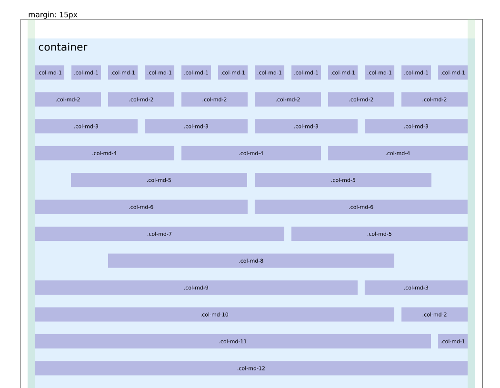
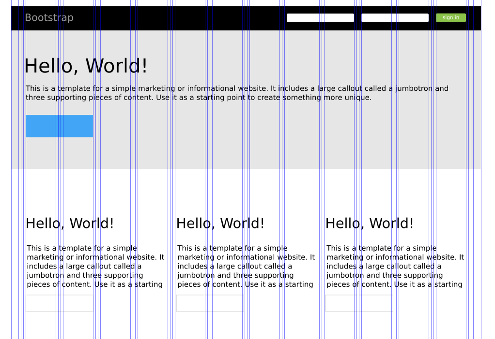

# Inkscape grid template for bootstrap

When I started work with [Bootstrap](http://getbootstrap.com/) I
missed a inkscape template to design my projects. So I create this template files
following the bootrstrap grid documentation.

I hope this files help you to learning and/or design your own project

## Using

To view the guidelines, open the file on inkscape and select on menu View > Guides

Shortcut:

`Shift` + `|` (pipe)

---

In this new version, I added layers with samples and guides to help you design and learning
how bootstrap grid works!

### Grid guide
This layer show 12 columns filled in red! You should use to check if your layout is gridded

### Using grid
This layer show how bootstrap grid works! You can see how each column fit on the grid.

### Template example
This layer has a sample implementation of [jumbotron template ](http://getbootstrap.com/examples/jumbotron/)

## Licesing

This project is licensed under APLGv3 and MIT License.
For more information refer to the respectives COPYING files.

